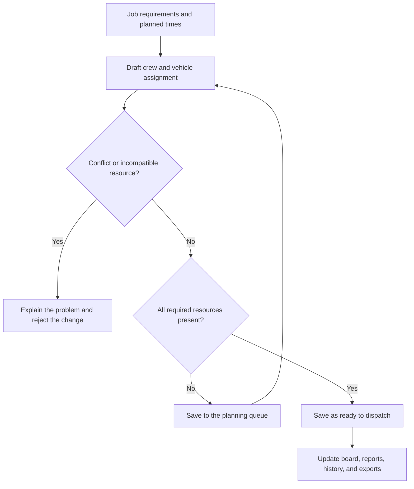

# Dispatch Board

**A dispatch planning and reporting demo for moving operations.**

Relay brings jobs, crews, vehicles, and planning gaps into one workspace. Its rules-based engine checks a dispatcher's proposed assignments before a job can move into the ready queue, then keeps the schedule, reports, and exports consistent with those changes.

Built with **HTML, CSS, and vanilla JavaScript**. No installation, build process, or backend is required. All records are fictional.

[Quick start](#quick-start) · [Screenshots](#screenshots) · [How the engine works](#how-the-engine-works) · [Project structure](#project-structure) · [Engine guide](docs/ENGINE.md)

## Why this project

Dispatch planning involves several decisions at once: whether a driver is trained for a truck, whether a foreman can lead the crew, whether enough movers and packers are available, and whether those resources are already booked elsewhere.

Relay makes those checks part of the assignment workflow. Incomplete jobs remain visible in a planning queue, while conflicting or incompatible assignments are refused. The reporting view helps a dispatcher see what is covered and where work is still needed.

## Screenshots

**Space reserved for screenshots.** Add captures to [`docs/screenshots/`](docs/screenshots/README.md), then enable the image links below. The folder includes capture instructions and suggested filenames.

| View | Suggested screenshot | Status |
| --- | --- | --- |
| Daily dispatch board | `docs/screenshots/board-desktop.png` | Ready for a screenshot |
| Crew and vehicle assignment | `docs/screenshots/assignment-panel.png` | Ready for a screenshot |
| Operations report | `docs/screenshots/operations-report.png` | Ready for a screenshot |
| Mobile board | `docs/screenshots/board-mobile.png` | Optional screenshot |

<!-- Uncomment each image after its file is added. These are placeholders, not broken image links.
### Dispatch board


### Assignment panel


### Operations report


### Mobile view

-->

## Features

| Area | What you can do |
| --- | --- |
| **Dispatch board** | Review jobs by status, change their status with drag-and-drop, and use the three-day board to reschedule jobs. |
| **Assignments** | Assign a driver, a separate foreman, a vehicle, movers, and packers; use multiple trucks or a contractor team. |
| **Validation** | Check vehicle training, licence level, clearance, time conflicts, load capacity, and requested crew counts. |
| **Schedule** | Search by job, customer, place, or person; filter by service or planning gaps; sort the table. |
| **Reports** | Review dispatch coverage, resource commitments, planning gaps, service mix, and recorded load. |
| **History** | Inspect the activity log, undo or redo changes, and restore the original demo. |
| **CSV exports** | Export the selected schedule, daily summary, or activity log. |
| **Local storage** | Keep saved jobs and activity in the current browser when storage is available. |

## Quick start

1. Download or clone this repository.
2. Keep `index.html` and the `assets/` folder together.
3. Open `index.html` in a modern browser.

The app works offline. You can also serve the repository with any static web server. If Python is installed:

```bash
python3 -m http.server 8000
```

Then open `http://localhost:8000`.

### Try the workflow

1. Open a job in **To plan** and review its missing resources.
2. Select its vehicle, driver, foreman, movers, and packers. Unavailable choices show the reason.
3. Save the assignment. A complete assignment becomes **Ready to go**.
4. Start the job, then mark it completed. Both the board and reports update.
5. Export the schedule or undo your last change.

You can also create a new fictional job to explore the planning queue. Dragging is optional: dates, resources, and status can be changed in the job panel.

### Keyboard shortcuts

| Shortcut | Action |
| --- | --- |
| `/` | Focus search |
| `N` | Create a job |
| `Ctrl` / `⌘` + `Z` | Undo |
| `Ctrl` / `⌘` + `Shift` + `Z` | Redo |
| `Esc` | Close a dialog or export menu |

## How the engine works

The engine is a **rules-based assignment validator**. The dispatcher selects resources; the engine checks whether those selections work together. It does not automatically generate an optimized schedule.



### Main assignment rules

- **Separate roles:** a driver operates the vehicle; a foreman leads the job. Foremen count toward requested movers, while drivers do not.
- **Vehicle eligibility:** each driver must meet the selected vehicle's training and licence levels. A higher licence alone does not override insufficient training.
- **Availability:** a person, vehicle, or contractor cannot serve two overlapping planned jobs. The same resource also cannot occupy two truck slots on one job.
- **Crew capacity:** each internal truck carries at most four riders besides its driver, including the foreman.
- **Job coverage:** missing drivers, foremen, vehicles, survey weights, movers, or packers keep the job in the planning queue.
- **Load capacity:** selected vehicles must meet the minimum requested level and collectively cover the recorded load.
- **Restricted sites:** internal staff and contractor teams must have the required clearance.
- **Contractors:** a contractor supplies its own vehicle and crew; the crew count includes its lead.

The same validation functions support resource pickers, saves, drag-and-drop, reporting, and export checks. See the [engine guide](docs/ENGINE.md) for the data model, function map, and worked examples.

## Project structure

| Path | Purpose |
| --- | --- |
| [`index.html`](index.html) | Application entry point and accessible page structure. |
| [`assets/css/styles.css`](assets/css/styles.css) | Layout, theme, responsive styles, and print styles. |
| [`assets/js/app.js`](assets/js/app.js) | Fictional data, assignment rules, UI behavior, reports, persistence, and exports. |
| [`docs/ENGINE.md`](docs/ENGINE.md) | Detailed explanation of the engine and reporting calculations. |
| [`docs/screenshots/`](docs/screenshots/README.md) | Reserved screenshot gallery and capture instructions. |
| [`tests/engine-checks.cjs`](tests/engine-checks.cjs) | Dependency-free checks for the demo's core rules. |
| [`.gitignore`](.gitignore) | Excludes local system files, logs, and environment files. |

## Demo data

| Record type | Included |
| --- | ---: |
| Jobs | 39 over three days |
| People | 49 |
| Vehicles | 14 |
| Contractor teams | 3 |

The scenario covers October 14–16, 2030. Some jobs deliberately start with missing weights or crew so the planning workflow can be explored. Multi-truck jobs are included.

Names, locations, identifiers, vehicle records, and notes are invented. No source operational records are included. Sample data is created by `makeSeed()` and `makeRoster()`, with fleet and contractor records declared in `assets/js/app.js`.

## Reporting and exports

- **Coverage** counts ready, in-progress, or completed jobs whose assignment checks all pass.
- **Needs attention** includes planning jobs and jobs with assignment issues.
- **Resource use** counts distinct internal resources committed on a day, including completed jobs. Across all three days, each resource category shows its highest daily count. This is not hours-based utilization.
- **Recorded load** counts each job once and reports missing weights separately.
- **Filtering** affects charts, tables, and schedule/summary exports. The overview cards cover the full selected date range. Activity history is workspace-wide.

The schedule CSV contains one row per internal truck or contractor assignment. Job-level fields repeat on multi-truck rows; deduplicate by `job_id` before summing them. Daily summaries already count each job once.

## Development checks

The app needs no development dependencies. With Node.js installed, run:

```bash
node tests/engine-checks.cjs
```

The checks cover the seed schedule, resource conflicts, training, clearance, crew capacity, contractor counts, multi-truck totals, persistence shape, and CSV handling. They validate the logic without launching a browser.

## Scope and current limits

This is a local portfolio demo with manually controlled job statuses. It has no backend, multi-user synchronization, live arrival feed, route optimization, automated crew recommendation, or predictive model. Travel buffers and work-hour limits are not part of the current assignment model.

Saved jobs and activity use the browser key `relay-fictional-dispatch-v1`. Storage behavior for locally opened files varies; the app shows **Session only** when saving is unavailable. Undo/redo history lasts for the current session. Local edits are not written back into the source files.

The app uses no external assets, tracking, API keys, or network requests. User-entered text is escaped for HTML, and formula-like CSV values are neutralized before export.
